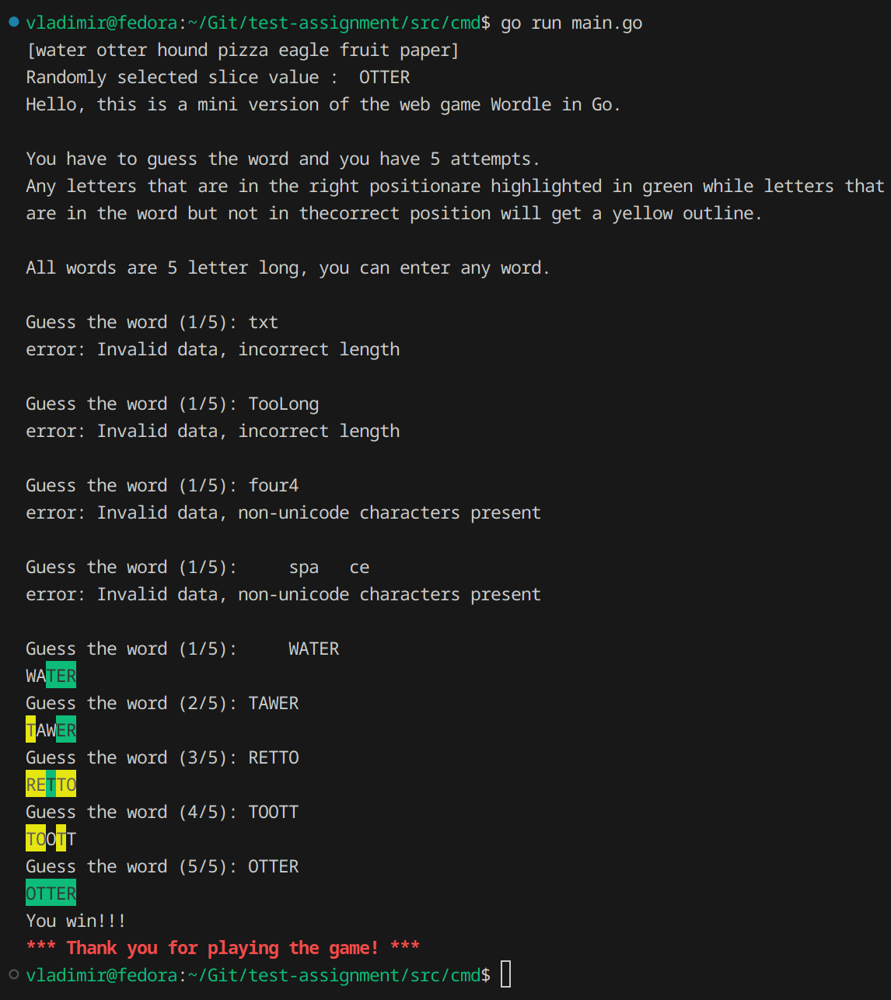

# Summary
It's a brief assessment, that's a command-line version of the web game Wordle in Go.

This repository contains the ["Programming Skill Assessment" definition file](wordletest_go_v1.odt) and the [Go project code itself](/app/Go/).

# Running
Go to the [/app/Go/wordle/cmd](/app/Go/wordle/cmd/) directory and    execute `go run wordle.go`  

To run the entire Go codebase tests go to [/app/Go/](/app/Go/) directory and execute `go test ./...`

## Tech Stack
1) Golang 1.22.4

## Requirements
* The only non-standard library allowed is the github.com/fatih/color for the terminal colors.
* All errors must be handled in main(); i.e. no log.Fatalln or os.Exit in other functions.
* Package math/rand can be used instead of crypto/rand.     

# Methods & tweaks
## [CMD pattern](https://github.com/golang-standards/project-layout/blob/master/cmd/README.md)
CMD pattern - a file convention in Go, helps to manage multiple main.go entry-points in the future and reuse the code, this also helps to keep the root directory clean [e.g., Kubernetes uses this pattern a lot](https://github.com/kubernetes/kubernetes/tree/master/cmd). 

## DDD - Domain Driven Design
Domain Driven Design was the key idea behind thisc codebase. Altough the task is tiny, it carries few domain errors related to system data format (only unicode characters allowed, consistant data input length) and a model file with little type-related validation functions.

## [Table Driven Tests](https://go.dev/wiki/TableDrivenTests)
Table Driven Tests is a way to write cleaner tests, this reduces the amount of repeated code in the tests and boosts code readability. 

